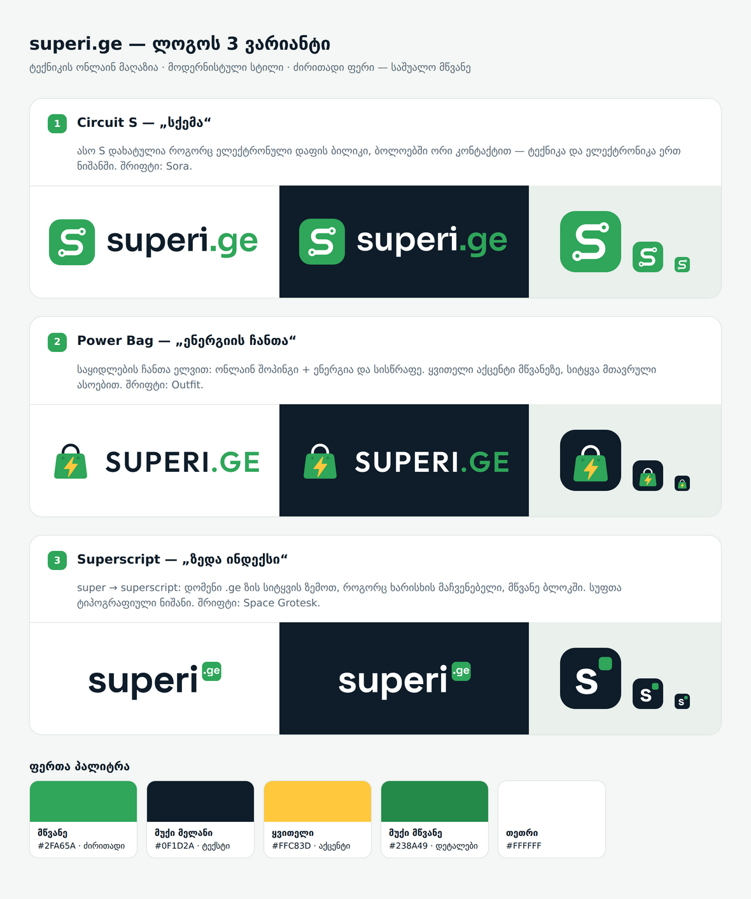

# superi.ge — ლოგოს ვარიანტები

ტექნიკის ონლაინ მაღაზიის ლოგოს 3 ვარიანტი. სტილი მოდერნისტულია, ძირითადი ფერი საშუალო მწვანეა.

## ვარიანტები

| # | სახელი | იდეა | შრიფტი |
|---|--------|------|--------|
| 1 | **Circuit S** | ასო S დახატულია როგორც ელექტრონული დაფის ბილიკი, ბოლოებში ორი კონტაქტით | Sora |
| 2 | **Power Bag** | საყიდლების ჩანთა ელვით (ონლაინ შოპინგი და ენერგია) | Outfit |
| 3 | **Superscript** | super → superscript: `.ge` ზის სიტყვის ზემოთ, როგორც ხარისხის მაჩვენებელი | Space Grotesk |

## ფაილები

თითოეულ საქაღალდეში (`1-circuit/`, `2-power-bag/`, `3-superscript/`) არის:

- `superi-logo.svg` — მთავარი ლოგო, ღია ფონისთვის
- `superi-logo-on-dark.svg` — ლოგო მუქი ფონისთვის (თეთრი ტექსტით)
- `superi-icon.svg` — კვადრატული აიკონი (favicon, აპლიკაცია, სოც. ქსელები)

ყველა ტექსტი გადაყვანილია ვექტორულ კონტურებად, ამიტომ ფაილებს შრიფტის დაყენება არ სჭირდება.
გამოყენებული შრიფტები (Sora, Outfit, Space Grotesk) Google Fonts-ის უფასო შრიფტებია (OFL ლიცენზია).

ყველა ვარიანტი ერთად: [`preview.html`](preview.html).

## ფერები

| ფერი | HEX | სად |
|------|-----|-----|
| მწვანე | `#2FA65A` | ძირითადი ფერი |
| მუქი მელანი | `#0F1D2A` | ტექსტი, მუქი ფონი |
| ყვითელი | `#FFC83D` | აქცენტი (ვარიანტი 2) |
| მუქი მწვანე | `#238A49` | წვრილი დეტალები |
| თეთრი | `#FFFFFF` | ფონი, ტექსტი მუქზე |
