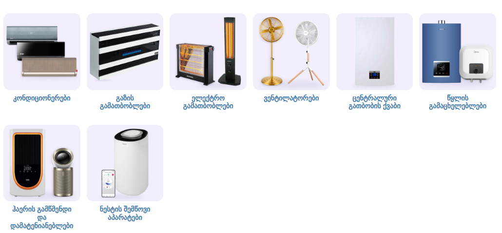

# კლიმატური ტექნიკა — ქვეკატეგორიების ბანერები

კატეგორია: [კლიმატური ტექნიკა](https://superi.ge/klimaturi-teqnika/) · 800×800 PNG · სტილი: [../README.md](../README.md)

შენს გვერდზე, [`subcategory-grid.css`](../subcategory-grid.css)-ით:

| ფაილი | ქვეკატეგორია | პროდუქტები (superi.ge-დან) |
|---|---|---|
| `01-kondicionerebi.png` | [კონდიციონერები](https://superi.ge/kondicionerebi/) | Midea MSAG (ნაცრისფერ-ლურჯი) + Mayer TAC (შავი) + Midea XT (ოქროსფერი) |
| `02-gazis-gamatboblebi.png` | [გაზის გამათბობლები](https://superi.ge/gazis-gamatboblebi/) | Fujiyama FHS 12000 MFC |
| `03-eleqtro-gamatboblebi.png` | [ელექტრო გამათბობლები](https://superi.ge/eleqtro-gamatboblebi/) | Kumtel KS-2760 + Kumtel MH-1800 |
| `04-ventilatorebi.png` | [ვენტილატორები](https://superi.ge/ventilatorebi/) | Reffon FS-40M (ოქროსფერი) + Sencor SFN 4080 (ხის სამფეხით) |
| `05-tsentraluri-gatbobis-qvabi.png` | [ცენტრალური გათბობის ქვაბი](https://superi.ge/tsentraluri-gatbobis-qvabi/) | Beko Prodens 30 Premix |
| `06-tsklis-gamatskheleblebi.png` | [წყლის გამაცხელებლები](https://superi.ge/tsklis-gamatskheleblebi/) | Kettler JSG12GT (ლურჯი) + Midea MWH15 |
| `07-haeris-gamtsmendi-da-damatenianeblebi.png` | [ჰაერის გამწმენდი და დამატენიანებლები](https://superi.ge/haeris-gamtsmendi-da-damatenianeblebi/) | Beko ATP5500N + Dreame PM20 |
| `08-tenis-amomshrobebi.png` | [ნესტის შემწოვი აპარატები](https://superi.ge/tenis-amomshrobebi/) | Sencor SDH 1210WH |

წყაროები და განლაგება: [banners.json](banners.json).
