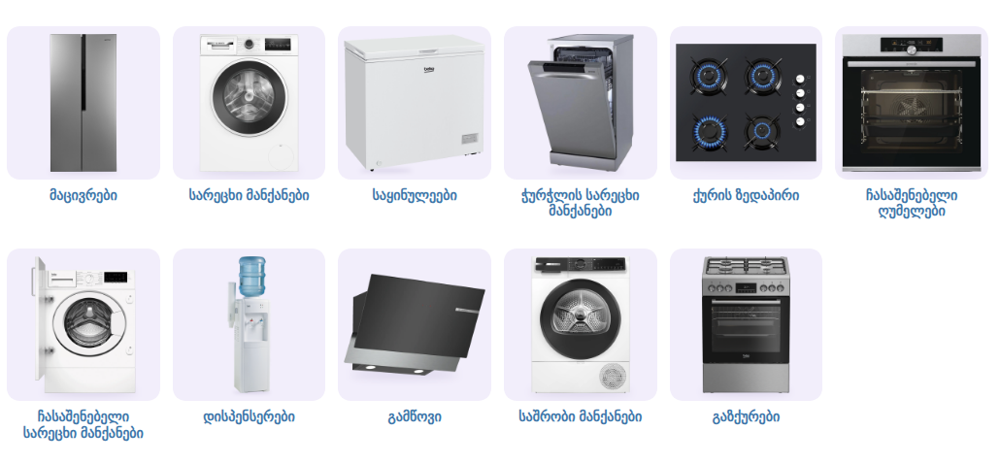

# საყოფაცხოვრებო ტექნიკა — ქვეკატეგორიების ბანერები

კატეგორია: [საყოფაცხოვრებო ტექნიკა](https://superi.ge/sakopatskhovrebo-teqnika/) · 800×800 PNG · სტილი: [../README.md](../README.md)

ერთიანი, მშვიდი პალიტრა: უჟანგავი ფოლადი, შავი მინა, თეთრი. თანამედროვე, ტიპური მოდელები, თითო ბარათზე ერთი;
ფერადი აქცენტი მხოლოდ ფუნქციიდან (ცისფერი ალი, ნათურით განათებული ღუმელი, წყლის ბოთლი).

შენს გვერდზე, [`subcategory-grid.css`](../subcategory-grid.css)-ით:

| ფაილი | ქვეკატეგორია | პროდუქტი (superi.ge-დან) |
|---|---|---|
| `01-macivrebi.png` | [მაცივრები](https://superi.ge/macivrebi/) | GORENJE NRS8182KX |
| `02-saretskhi-manqanebi.png` | [სარეცხი მანქანები](https://superi.ge/saretskhi-manqanebi/) | BOSCH WAN28201ME (8კგ) |
| `03-sakinule.png` | [საყინულეები](https://superi.ge/sakinule/) | BEKO CF200EWN b100 (198ლ) |
| `04-churchelis-saretskhi-manqanebi.png` | [ჭურჭლის სარეცხი მანქანები](https://superi.ge/churchelis-sarecxhi-manqanebi/) | GORENJE GS541D10X |
| `05-quris-zedapiri.png` | [ქურის ზედაპირი](https://superi.ge/quris-zedapiri/) | KUMTEL KO-40TAHDF B |
| `06-chasashenebeli-ghumelebi.png` | [ჩასაშენებელი ღუმელები](https://superi.ge/chasashenebeli-ghumelebi/) | GORENJE BOS6747A01X |
| `07-chasashenebeli-saretskhi-manqanebi.png` | [ჩასაშენებელი სარეცხი მანქანები](https://superi.ge/chasashenebeli-saretskhi-manqanebi/) | BEKO WITC 7613 XW (7კგ) |
| `08-dispenserebi.png` | [დისპენსერები](https://superi.ge/dispenserebi/) | BEKO BSS 2201 TT |
| `09-gamtsovi.png` | [გამწოვი](https://superi.ge/gamtsovi/) | BOSCH DWK66AJ60T |
| `10-sashrobebi.png` | [საშრობი მანქანები](https://superi.ge/sashrobebi/) | BOSCH WQK25200ME (10კგ) |
| `11-gazqurebi.png` | [გაზქურები](https://superi.ge/gazqurebi/) | BEKO FBE6330GXDSN |

წყაროები: [banners.json](banners.json).
