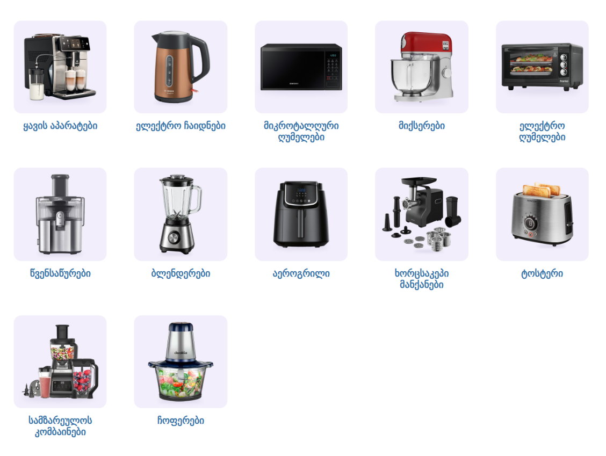

# Superi.ge — ქვეკატეგორიების ბანერები (alta.ge-ს სტილში)

კატეგორია: [სამზარეულოს ტექნიკა](https://superi.ge/samzarelos-teqnika/)

- ზომა: **800×800 px**, PNG
- ფონი: ღია იასამნისფერი `#F2EEFB` (იგივე ფერი, რაც alta.ge-ზე), მომრგვალებული კუთხეებით
- ბანერზე ტექსტი არ წერია — დასახელებას საიტი თავად წერს ქვემოთ
- კუთხეები გამჭვირვალეა; საიტი ატვირთვისას თეთრ ფონზე გადაიყვანს, ამიტომ თეთრ გვერდზე ზუსტად ბარათივით გამოჩნდება



| ფაილი | ქვეკატეგორია |
|---|---|
| `01-yavis-aparatebi.png` | [ყავის აპარატები](https://superi.ge/yavis-aparatebi/) |
| `02-eleqtro-chaidnebi.png` | [ელექტრო ჩაიდნები](https://superi.ge/eleqtro-chaidnebi/) |
| `03-mikrotalghuri-ghumelebi.png` | [მიკროტალღური ღუმელები](https://superi.ge/category-68/) |
| `04-miqserebi.png` | [მიქსერები](https://superi.ge/category-69/) |
| `05-eleqtro-ghumelebi.png` | [ელექტრო ღუმელები](https://superi.ge/eleqtro-gumelebi/) |
| `06-wvensawurebi.png` | [წვენსაწურები](https://superi.ge/category-85/) |
| `07-blenderebi.png` | [ბლენდერები](https://superi.ge/category-86/) |
| `08-aerogrili.png` | [აეროგრილი](https://superi.ge/aerogrilebi/) |
| `09-xorcsakepi-manqanebi.png` | [ხორცსაკეპი მანქანები](https://superi.ge/xorcis-sakepi-manqanebi/) |
| `10-tosteri.png` | [ტოსტერი](https://superi.ge/category-110/) |
| `11-samzareulos-kombainebi.png` | [სამზარეულოს კომბაინები](https://superi.ge/samzareulos-kombainebi/) |
| `12-choferebi.png` | [ჩოფერები](https://superi.ge/choferebi/) |

შენიშვნა: ჩაიდნის, მიქსერისა და წვენსაწურის ძველი სურათები ძალიან პატარა იყო (200–300 px) და გაბუნდოვნდებოდა,
ამიტომ მათ ნაცვლად ავიღე იმავე ქვეკატეგორიიდან superi.ge-ზე არსებული პროდუქტის მაღალი ხარისხის ფოტო:
Bosch TWK4P439 (ჩაიდანი), Kenwood kMix KMX750ARD (მიქსერი), Braun MultiJuice 7 SJ7000 (წვენსაწური).
დანარჩენ 9 ბანერზე ის პროდუქტია, რომელიც საიტზე იყო (მიკროტალღური — იგივე Samsung MS23J5133AK, უფრო დიდი ფოტოდან).

ბანერის გარშემო თეთრი ჩარჩო საიტის თემის padding-ია (უჯრა 10px + სურათი 10px) და არა სურათის ზომა.
თუ გინდა, რომ იასამნისფერმა ბარათმა უჯრა სიგანეში მეტად შეავსოს, თემის Custom CSS-ში დაამატე:

```css
.ty-subcategories__item.cat-img .ty-subcategories-img { padding: 0 0 10px; }
```

ასე გამოიყურება ამ CSS-ით (შენს საიტზე გადამოწმებული): [preview-css.png](preview-css.png)
