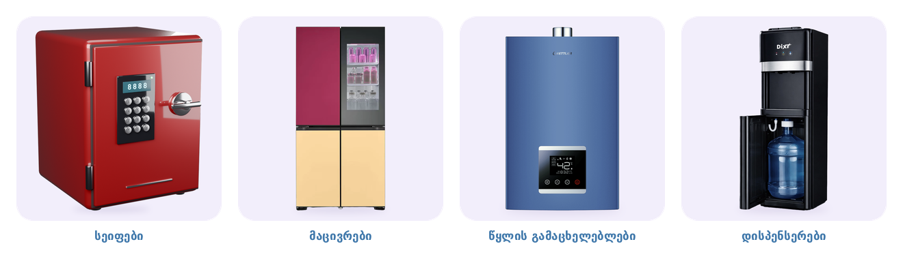

# სეიფები — ბანერი

800×800 PNG · სტილი: [../README.md](../README.md)

| ფაილი | ქვეკატეგორია | პროდუქტი |
|---|---|---|
| `01-seifebi.png` | სეიფები | ელექტრონული სეიფი კოდით — 3D სტუდიური რენდერი |

superi.ge-ზე სეიფები ჯერ არ არის (საიტის ძიება და sitemap: 4210 პროდუქტი, 112 კატეგორია — სეიფი არცერთში),
ამიტომ ფოტოს ნაცვლად სეიფი Blender-ში დავამზადე: მუქი წითელი პრიალა საღებავი, შავი მინის კლავიატურა ეკრანით,
ქრომის სახელური და ანჯამები, იგივე სტუდიური განათება და ჩრდილი, რაც დანარჩენ ბანერებზე.
რენდერის სკრიპტი: [../tools/render_safe.py](../tools/render_safe.py), წყარო: [safe-render.png](safe-render.png).
სეიფებს საიტზე რომ დაამატებ, შეგიძლია ნამდვილი პროდუქტის ფოტოთიც ჩავანაცვლოთ.
