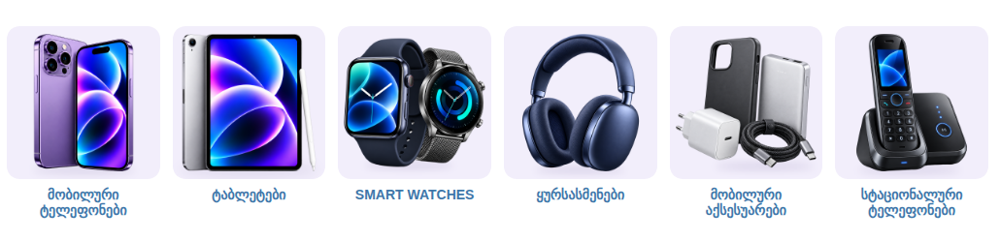

# ტელეფონები, ტაბლეტები — ქვეკატეგორიების ბანერები

კატეგორია: [ტელეფონები, ტაბლეტები, ელექტრონული წიგნები](https://superi.ge/telefonebi-tabletebi/) · 800×800 PNG · სტილი: [../README.md](../README.md)

შენს გვერდზე, [`subcategory-grid.css`](../subcategory-grid.css)-ით:

| ფაილი | ქვეკატეგორია |
|---|---|
| `01-mobiluri-teleponebi.png` | [მობილური ტელეფონები](https://superi.ge/mobiluri-teleponebi/) |
| `02-tabletebi.png` | [ტაბლეტები](https://superi.ge/tabletebi/) |
| `03-smart-watches.png` | [SMART WATCHES](https://superi.ge/smart-watches/) |
| `04-yursasmenebi.png` | [ყურსასმენები](https://superi.ge/yursasmenebi/) |
| `05-mobiluri-aqsesuarebi.png` | [მობილური აქსესუარები](https://superi.ge/mobiluri-aqsesuarebi/) |
| `06-statsionaluri-teleponebi.png` | [სტაციონალური ტელეფონები](https://superi.ge/statsionaluri-teleponebi/) |

ფოტოები: იგივე პროდუქტები, რაც საიტზე იყო (1254 px), ნაცრისფერი ფონიდან ამოჭრილი. წყაროები: [banners.json](banners.json).
